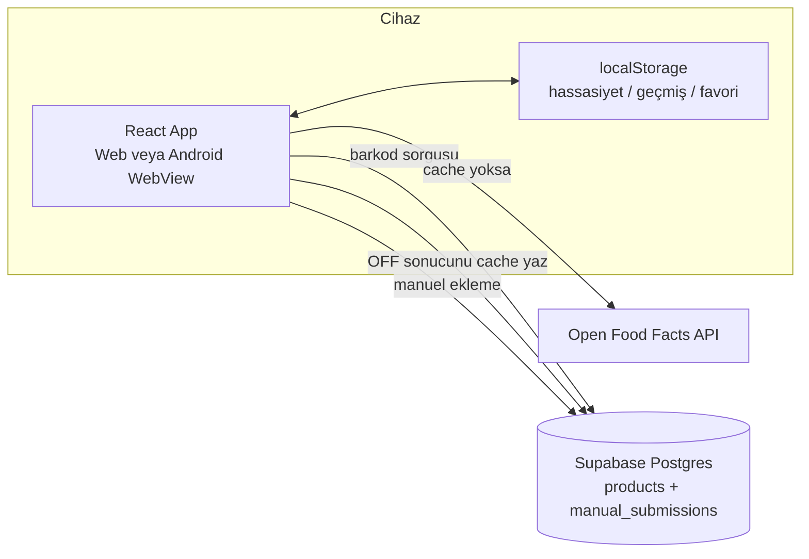
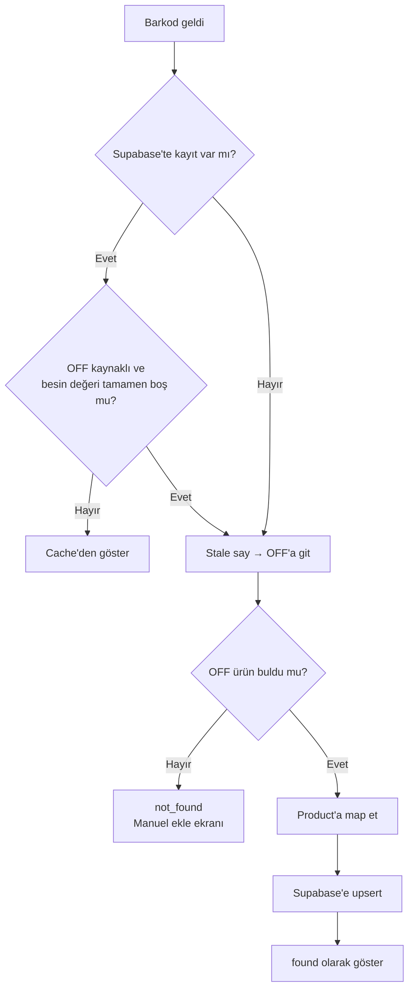
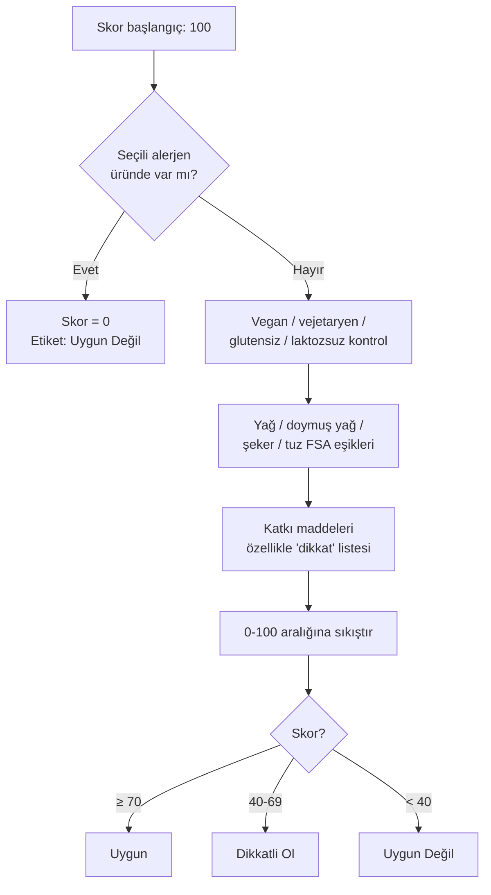
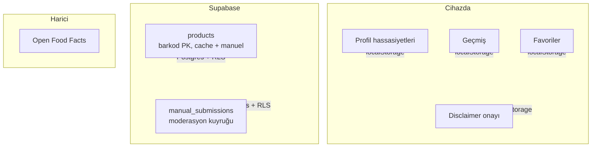
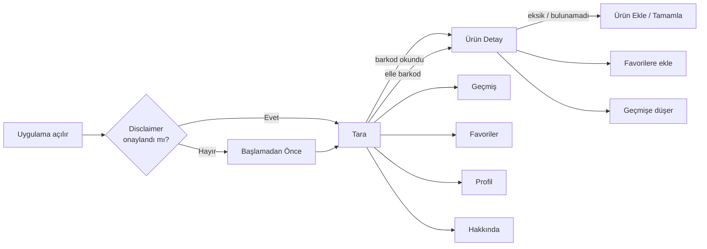
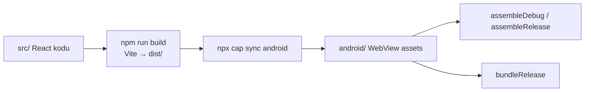

# Barkod İçerik Kontrol — Proje Sunumu

Bu dosya, projeyi **baştan sona** anlatır. Okuyan kişi mimariyi, veri akışını, ekranları, skorlamayı, mobil paketi ve bilinçli kararları anlayabilecek seviyeye gelsin diye yazıldı.

> Kod haritası için ayrıca `PROJE-REHBERI.md` · ilerleme için `ROADMAP.md` · cihaz testi için `TESTING.md` · Play Store teslimatı için `README_YAYIN.md`.

---

## 1) Ürün ne?

Kullanıcı bir gıda ürününün **barkodunu** kamerayla veya elle girer. Uygulama ürünün içindekilerini, besin değerlerini ve katkı maddelerini gösterir; kullanıcının seçtiği alerjen / diyet hassasiyetlerine göre bir **uygunluk skoru** üretir.

**Hedef kullanıcı:** Alerjisi olanlar, vegan / vejetaryen / glutensiz / laktozsuz diyet takip edenler, şeker–tuz–yağ takibi yapanlar.

**v1 kapsamı:**
- Web uygulaması (React) + Android sarmalama (Capacitor)
- Ürün verisi: Open Food Facts (OFF)
- Cache + manuel ekleme: Supabase
- Hassasiyet / geçmiş / favori: `localStorage` (hesap yok)
- Play Console’a biz girmiyoruz; imzalı AAB/APK teslim paketi hazır

---

## 2) Teknoloji yığını

| Katman | Teknoloji | Rolü |
|---|---|---|
| UI | React 19 + TypeScript | Ekranlar ve bileşenler |
| Build | Vite | Dev server + production bundle |
| Stil | Tailwind CSS v4 | Tasarım / responsive |
| Routing | React Router v7 | SPA sayfa geçişleri |
| Sunucu state | TanStack Query | Ürün sorgusu cache / refetch |
| Barkod | `@zxing/library` | Kamera ile barkod okuma |
| Ürün API | Open Food Facts | Harici ürün veritabanı |
| DB | Supabase (Postgres) | Ürün cache + manuel gönderimler |
| Cihaz verisi | `localStorage` | Profil, geçmiş, favori |
| Mobil | Capacitor 8 + Android | Web’i APK/AAB’ye sarma |

**Kritik mimari karar:** Ayrı bir Node/Express backend yok. Tarayıcı / Android WebView doğrudan OFF API’sine ve Supabase’e konuşur.



---

## 3) Klasör ve sorumluluk haritası

```
barcode-app/
├── src/                          ← Tüm uygulama kodu (biz yazdık)
│   ├── main.tsx                  ← Giriş: QueryClient + ErrorBoundary
│   ├── App.tsx                   ← Rotalar + NavBar + DisclaimerGate
│   ├── index.css                 ← Tailwind + tema renkleri
│   ├── pages/                    ← Ekranlar
│   ├── components/               ← UI parçaları
│   ├── hooks/                    ← React hook’ları
│   └── lib/                      ← İş mantığı (API, skor, storage)
├── supabase/migrations/          ← DB şeması + RLS
├── android/                      ← Capacitor native Android projesi
├── teslimat-mobil/               ← AAB/APK/keystore (gitignore’da)
├── public/                       ← Statik ikon
├── PROJE-SUNUMU.md               ← Bu dosya
├── PROJE-REHBERI.md              ← Kod detay rehberi
├── ROADMAP.md                    ← Sprint planı / durum
├── TESTING.md                    ← Manuel test checklist
└── README_YAYIN.md               ← Play Store yayın adımları
```

### Sayfalar (`src/pages/`)

| Dosya | Route | Ne yapar |
|---|---|---|
| `ScanPage.tsx` | `/` | Kamera + barkod okuma / elle giriş |
| `ProductPage.tsx` | `/urun/:barcode` | Ürün detay, skor, eksik bilgi uyarısı |
| `HistoryPage.tsx` | `/gecmis` | Tarama geçmişi |
| `FavoritesPage.tsx` | `/favoriler` | Favoriler |
| `ProfilePage.tsx` | `/profil` | Alerjen / diyet / besin takibi |
| `ManualAddPage.tsx` | `/urun-ekle/:barcode` | Manuel ekleme veya eksik bilgi tamamlama |
| `AboutPage.tsx` | `/hakkinda` | Sorumluluk reddi, gizlilik, kaynak |

### İş mantığı (`src/lib/`)

| Dosya | Sorumluluk |
|---|---|
| `openFoodFacts.ts` | OFF API çağrısı + ham JSON → `Product` |
| `productRepository.ts` | Önce Supabase, sonra OFF; cache yazma |
| `ingredients.ts` | İçindekiler metnini temizleme / parse |
| `scoring.ts` | Uygunluk skoru algoritması |
| `sensitivities.ts` | Alerjen / diyet seçenek tanımları |
| `manualSubmissions.ts` | Manuel ekleme + eksik veri merge |
| `history.ts` / `favorites.ts` | localStorage okuma-yazma |
| `additives.ts` | E-kodları ve “dikkat” listesi |
| `nutritionThresholds.ts` | FSA trafik ışığı eşikleri |
| `supabaseClient.ts` | Supabase client (env yoksa `null`) |
| `types.ts` | Ortak TypeScript tipleri |

---

## 4) Ana akış: barkod okutulunca ne olur?

```mermaid
sequenceDiagram
  actor U as Kullanıcı
  participant Scan as ScanPage
  participant Prod as ProductPage
  participant RQ as React Query<br/>useProduct
  participant Repo as productRepository
  participant SB as Supabase
  participant OFF as Open Food Facts
  participant Score as scoring.ts
  participant LS as localStorage

  U->>Scan: Kamerayı aç / barkod göster
  Scan->>Scan: @zxing barkodu okur
  Scan->>Prod: /urun/:barkod (fromScan: true)

  Prod->>RQ: useProduct(barkod)
  RQ->>Repo: resolveProduct(barkod)

  Repo->>SB: products tablosunda ara
  alt Cache dolu ve geçerli
    SB-->>Repo: Product
  else Cache yok veya bozuk OFF kaydı
    Repo->>OFF: GET /api/v2/product/{barkod}
    OFF-->>Repo: ham ürün JSON
    Repo->>Repo: map + içindekiler temizle
    Repo->>SB: upsert products (arka plan)
  end

  Repo-->>Prod: found / not_found / error
  Prod->>Score: calculateSuitabilityScore(ürün, hassasiyetler)
  Score-->>Prod: skor + etiket + nedenler
  Prod->>LS: geçmişe kaydet (sadece fromScan)
  Prod-->>U: Ekranda ürün + skor
```

### Adım adım (kısa)

1. **Tara** ekranı kamera stream’ini açar (`getUserMedia`).
2. `@zxing` her karede EAN/UPC/CODE-128 arar.
3. Barkod bulununca `/urun/{barkod}` sayfasına gider (`fromScan: true`).
4. `resolveProduct` önce Supabase `products`’a bakar.
5. Yoksa / bozuksa OFF’tan çeker, temizler, cache’e yazar.
6. Profildeki hassasiyetlerle skor hesaplanır.
7. İçindekiler / besin / katkı maddeleri gösterilir.
8. Gerçek taramaysa geçmişe yazılır; kalp ile favoriye alınabilir.

---

## 5) Ürün verisi nasıl çözülür?

### Kaynak önceliği



### OFF’tan gelen veriyi nasıl işliyoruz?

`openFoodFacts.ts` içinde:
- İstenen alanlar `fields=` ile sınırlanır.
- İçindekiler dili: **TR → EN → orijinal** `ingredients_text`.
- Hepsi boşsa yapılandırılmış `ingredients[]` listesinden metin üretilir.
- Etiket OCR çöplüğü `extractIngredientsSection` ile kesilir.
- Besin değerleri sadece OFF’un `nutriments` alanından map edilir — **uydurma değer yok**.

### Eksik OFF verisi (önemli ürün gerçeği)

OFF gönüllü bir veritabanı. Bazı barkodlarda ürün adı/görsel vardır ama içindekiler veya besin değeri yoktur (ör. Heinz `8696362804671`).

Bu durumda uygulama:
1. Ürünü yine gösterir (adı, markası, görseli varsa).
2. Sarı uyarı + **“Eksik Bilgiyi Sen Tamamla”** butonu çıkarır.
3. Kullanıcı formu doldurunca `manual_submissions` + `products` güncellenir (`source: manual`).

**PM’e tek cümle:** Eksik içerik çoğu zaman uygulama bug’ı değil; OFF kaynak veri kalitesidir. Kullanıcı tamamlama ile kendi DB’mizi dolduruyoruz.

---

## 6) Uygunluk skoru nasıl hesaplanır?

Dosya: `src/lib/scoring.ts`  
Girdi: `Product` + kullanıcının `UserSensitivities` (Profil / localStorage)



### Kurallar (özet)

| Kural | Etki |
|---|---|
| Seçili alerjen eşleşmesi | Skor **direkt 0** (sert engel) |
| Vegan / vejetaryen uyumsuzluk | −40 civarı |
| Glutensiz / laktozsuz uyumsuzluk | −30 / −40 |
| Besin “orta / yüksek” | Temel ceza + kullanıcı takip ediyorsa ekstra ceza |
| Katkı maddesi sayısı | Küçük ceza |
| “Dikkat” katkıları | Daha yüksek ceza + neden listesi |

Skor ekranda rozet + kısa neden listesi olarak gösterilir. Bu bir tıbbi tavsiye değildir; UI’da sorumluluk reddi (`DisclaimerNote` / `DisclaimerGate`) vardır.

---

## 7) Veri nerede tutulur?



### Supabase tabloları

**`products`**
- Barkoda göre tek satır
- OFF cache veya manuel tamamlanmış ürün
- Alanlar: isim, marka, görsel, içindekiler, `nutrition_json`, alerjen/katkı etiketleri, `source` (`off` | `manual`), `verified`

**`manual_submissions`**
- Kullanıcı gönderimlerinin denetim kaydı
- `status`: pending / approved / rejected
- Anon kullanıcı sadece **INSERT** yapabilir (SELECT yok — RLS tasarımı)

### Auth durumu (v1)

Supabase Auth **yok**. Herkes anon key ile okur/yazar (cache amaçlı). Kullanıcıya özel veri sunucuda tutulmaz.

---

## 8) Ekranlar ve kullanıcı yolculuğu



### Navigasyon

- Mobilde alt bar, geniş ekranda üst bar (`NavBar`)
- Rotalar `React.lazy` ile code-split: ilk açılışta ZXing/Supabase chunk’ları gereksiz yüklenmez

---

## 9) Mobil (Android / Capacitor)



| Öğe | Değer |
|---|---|
| Paket adı | `com.barkodkontrol.app` |
| Uygulama adı | Barkod İçerik Kontrol |
| Kamera | `AndroidManifest.xml` içinde `CAMERA` izni |
| Sync komutu | `npm run cap:sync` |
| Teslim klasörü | `teslimat-mobil/` (repoya girmez) |

Web’de yapılan her değişiklik mobilde görünmesi için:
1. `npm run cap:sync`
2. Gradle ile APK/AAB yeniden build
3. Telefona yeni APK kurulumu

Detaylı yayın adımları: `README_YAYIN.md`.

---

## 10) Geliştirme ve çalıştırma

```bash
# Bağımlılıklar
npm install

# .env (Supabase)
# VITE_SUPABASE_URL=...
# VITE_SUPABASE_ANON_KEY=...

# Web geliştirme
npm run dev

# Tip kontrol
npm run lint

# Production build
npm run build

# Android'e yansıt
npm run cap:sync
```

Supabase şeması: `supabase/migrations/0001_init.sql` dosyasını SQL Editor’de bir kez çalıştırın.

---

## 11) Bilinçli kararlar ve sınırlar

| Karar | Neden |
|---|---|
| Auth yok | 1–2 günlük MVP hızı; localStorage yeterli |
| OFF tek ürün kaynağı | Ücretsiz, CORS açık, geniş katalog |
| Supabase sadece cache + manuel | Tekrarlayan OFF çağrılarını azaltır, eksik ürünleri tamamlar |
| Capacitor (Expo değil) | Zaten web app vardı; sarmalamak daha hızlı |
| Skor “yaklaşık” | Tıbbi teşhis değil; anahtar kelime + etiket tabanlı |

### Bilinen sınırlar

- OFF’ta eksik ürünler boş gelebilir → kullanıcı tamamlama akışı
- Web’de (özellikle macOS) kamera ışığının geç sönmesi görülebilir; Android WebView’da genelde sorun değil
- Store ikonu / splash / mağaza metinleri henüz marka özelleştirmesi bekliyor
- iOS paketi v1 kapsamı dışı

---

## 12) Hızlı referans — “şu dosyaya bak”

| Soru | Dosya |
|---|---|
| Barkod nasıl okunuyor? | `src/pages/ScanPage.tsx` |
| Ürün nereden geliyor? | `src/lib/productRepository.ts` + `openFoodFacts.ts` |
| Skor nasıl çıkıyor? | `src/lib/scoring.ts` |
| Eksik ürün tamamlama? | `src/pages/ProductPage.tsx` + `manualSubmissions.ts` |
| Profil seçimleri? | `src/pages/ProfilePage.tsx` + `sensitivities.ts` |
| Rotalar? | `src/App.tsx` |
| DB şeması? | `supabase/migrations/0001_init.sql` |
| Android paket id? | `capacitor.config.json` + `android/app/build.gradle` |

---

## 13) Tek sayfalık özet

**Barkod İçerik Kontrol**, React + Vite web uygulamasıdır; Capacitor ile Android’e sarılır. Barkod okununca önce Supabase cache’e, yoksa Open Food Facts’e bakılır. Sonuç kullanıcı hassasiyetleriyle skorlanır; geçmiş/favori/profil cihazda tutulur. OFF verisi eksikse kullanıcı tamamlayabilir. Ayrı backend yoktur; teslimat imzalı AAB/APK + yayın rehberi ile yapılır.
